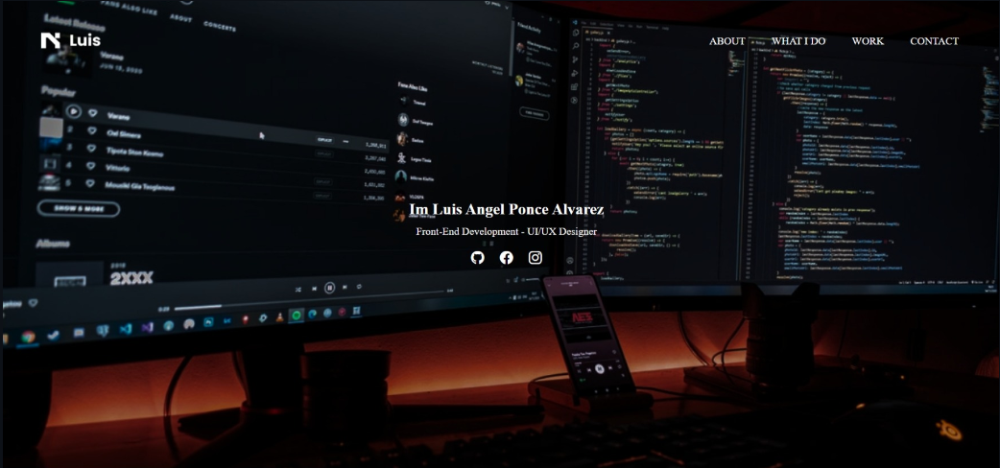

# Site1:Portafolio

## Descripción

Este proyecto es un sitio web desarrollado con html css para practicar las dos habilidades creando diferentes proyectos como estos en el proyecto tambien se utilizo MediaQueris para los tamaños de celulares y flexbox para acomodar las distintas partes de proyecto

## Miniatura

### Sitio

[Ver](https://luisangelponcealvarez.github.io/Site1/)
